# FetchAChef

[FetchAChef live!](http://fetchachef.com/)

FetchAChef is where Uber meets home cooking in a shareconomy app inspired by a hungry stomach! FetchAChef utilizes Ruby on Rails on the backend, a PostgreSQL database, and React.js with Redux on the frontend.

The app is about people cooking for other people (à la Uber), providing families with home-cooked meals and providing jobs for burgeoning chefs and underemployed workers with skill in the kitchen.

## Features & Implementation

### Single-Page App

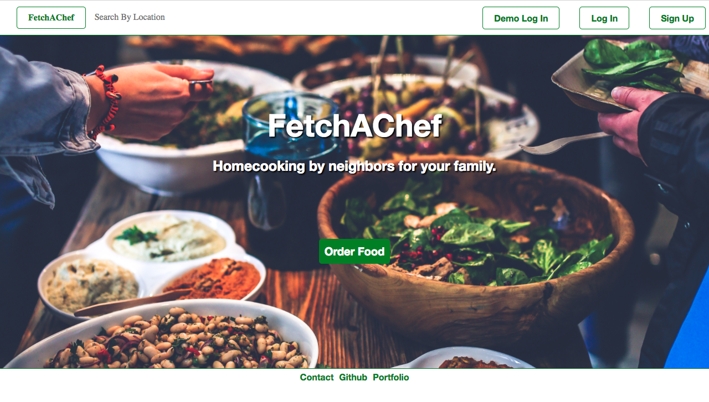

FetchAChef is a single-page app; all content is delivered on one static page. Sensitive information is kept safe via both backend and frontend user authentication.

### Account Login and Creation

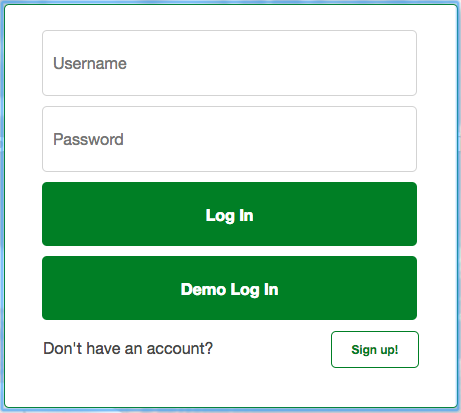

Existing users can login and maximize their fun while new users can sign up with an email address and password or use a provided guest account to poke around and get a feel for the app first.

Users have different drop down menus and accessibility based on whether they are normal users, chefs, and/or own a public kitchen where chefs can cook out of.


Protected paths prevent users from accessing routes they do not have access to.

### Different User Types Functionalities

After logging in, normal users can order food while posting and viewing reviews:
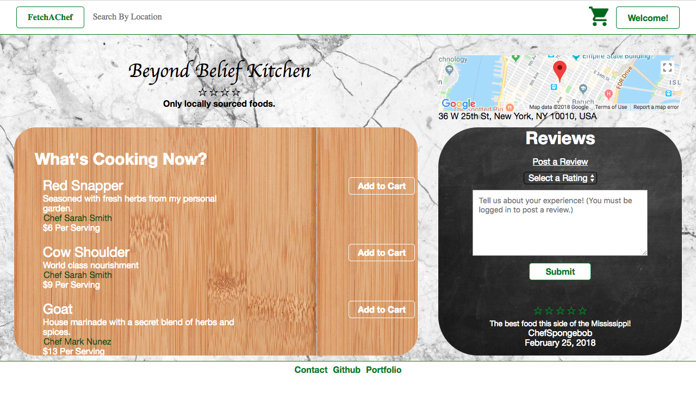

Sign up to become a chef:
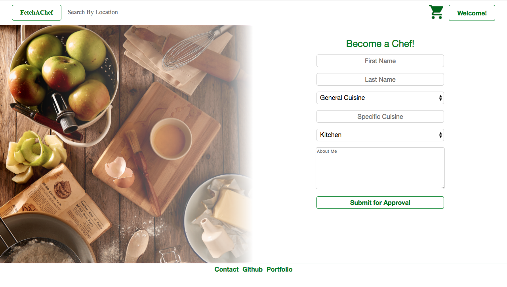

Sign up to open a kitchen:
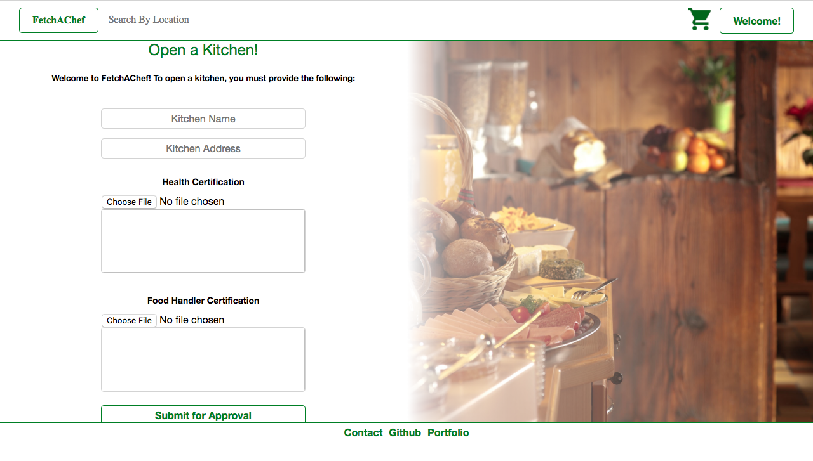

View their order histories:
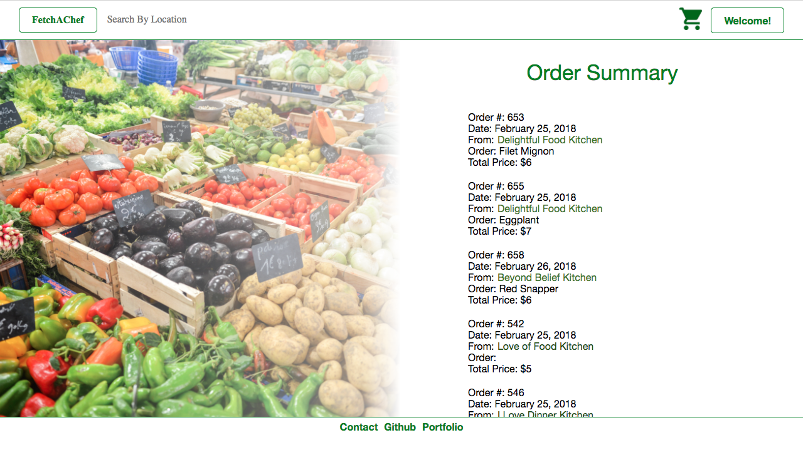

Edit their carts:
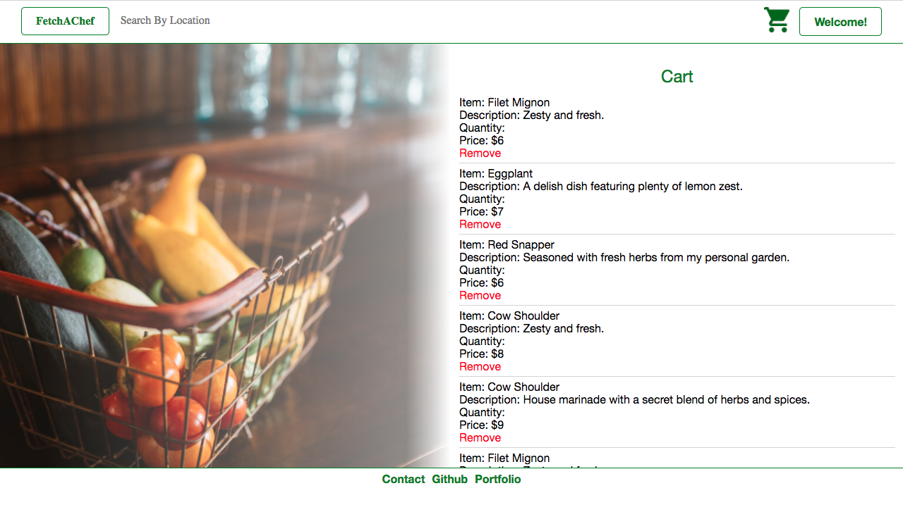

Check out different chef's profiles:
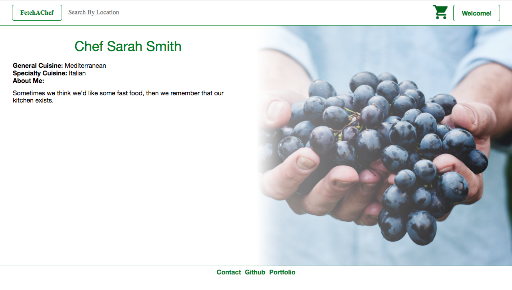

Change their passwords:
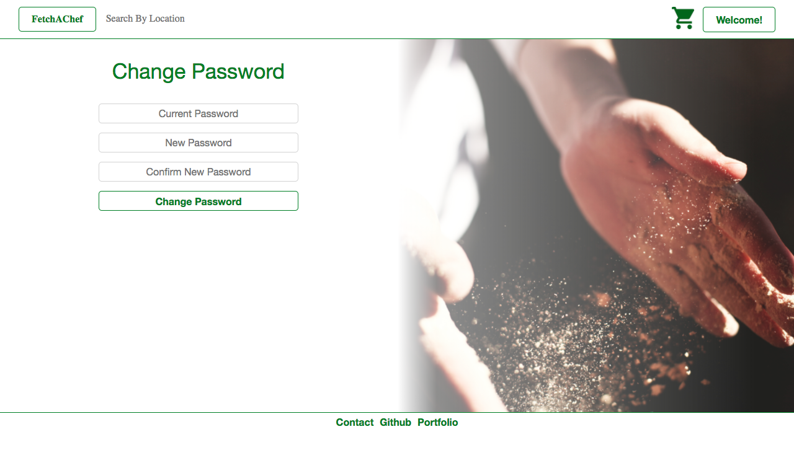

Chef users can do all of the above plus, edit their profiles and menu items:
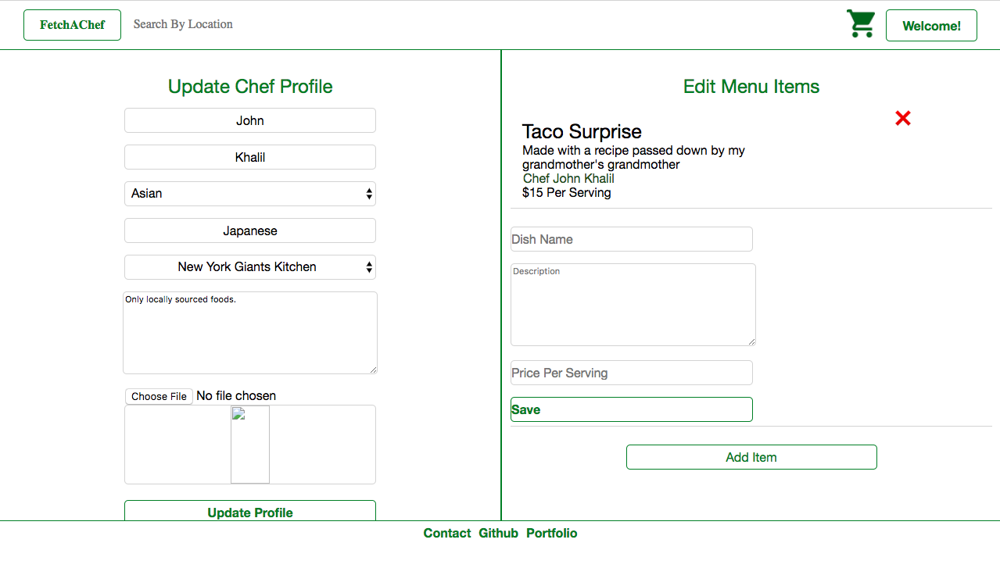

Finally, kitchen users can do everything that a normal user can do with the addition of editing their kitchen profiles and approving/denying applicant chefs:
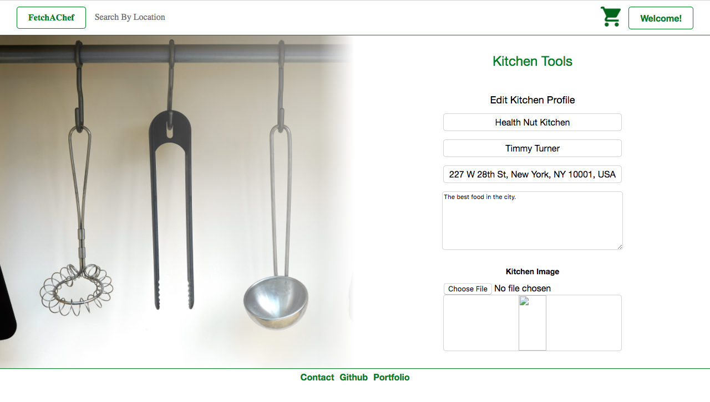
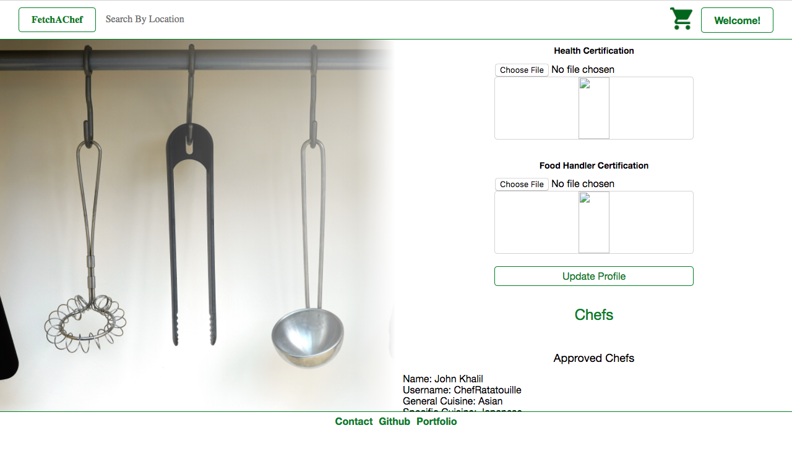
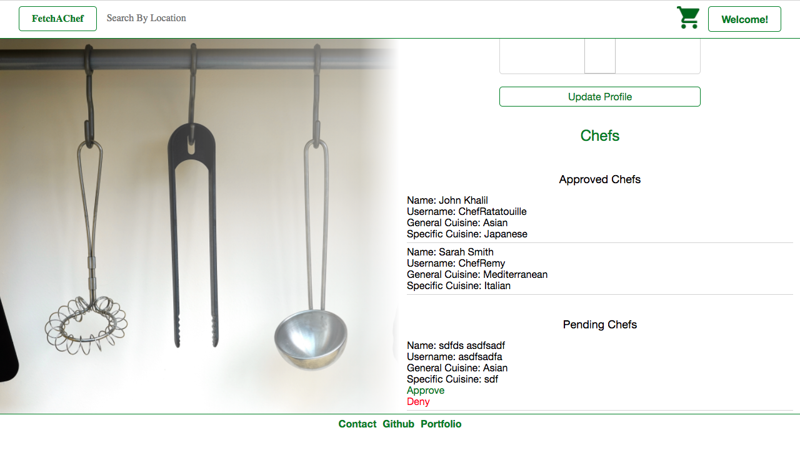

### File Upload

Users attempting to open an official kitchen are required to upload an image of their kitchen as well as documentation proving that they have the necessary health certification and food handler certification required to handle food in the USA. Images are hosted on AWS S3 allowing the app to scale.

When uploaded, every kitchen's address is converted into precise latitude and longitude coordinates so it can be accurately placed on a google maps integrated map.

### Browsing Kitchens

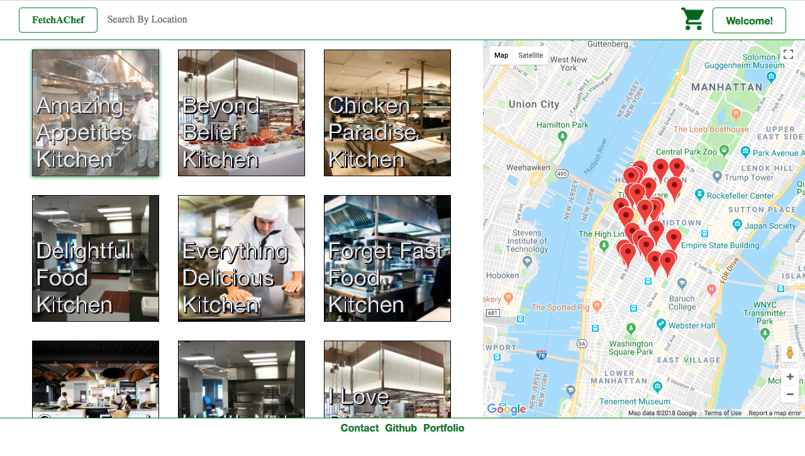

Search is an essential component of FetchAChef. With an autocomplete search bar always ready for a new address and a map itching to be moved, users can browse for kitchens until they finally remember how hungry they are.

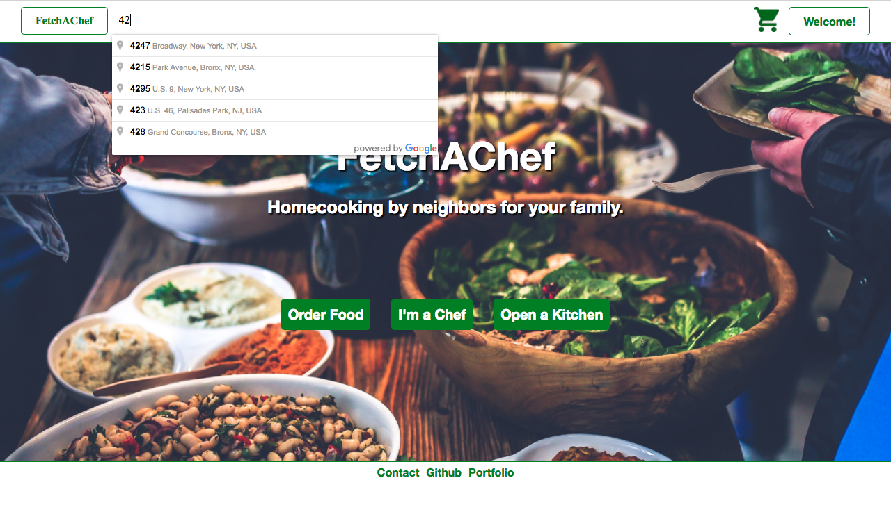

The map is fully functional; markers disappear and reappear as the map moves, each marker has an info-box that includes a kitchen's picture and name (plus each info-box is a link that can take you directly to a kitchen's profile). The search bar moves the map accurately and accordingly while the map tracks the current location of the user to allow for a more personalized experience!

FetchAChef utilizes custom SQL queries to fetch only the kitchens that reside in the current map area and meet the filter criteria rather than every single kitchen in the database. This results in significant server optimization.

### Code Organization

FetchAChef utilizes ES6, React 16, and Redux as well as a separation between container and presentational components to keep code up-to-date with current trends and best practices.

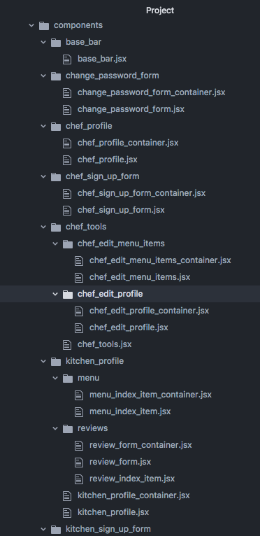
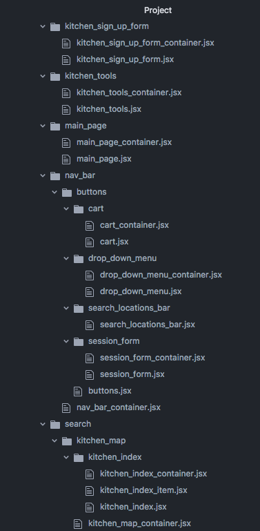
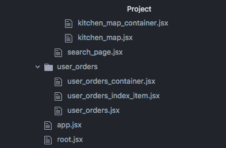

### Handling of Async functionality

FetchAChef leverages promises to handle async functionality:

```javascript
export const fetchAllKitchens = (bounds) => dispatch => (
  APIUtil.fetchAllKitchens(bounds).then(kitchens => (
    dispatch(receiveAllKitchens(kitchens))
  ))
);

export const fetchSingleKitchen = id => dispatch => (
  APIUtil.fetchSingleKitchen(id).then(kitchen => (
    dispatch(receiveSingleKitchen(kitchen))
  ))
);

export const createKitchen = kitchen => dispatch => (
  APIUtil.createKitchen(kitchen).then(newKitchen => (
    dispatch(receiveSingleKitchen(newKitchen))
  ))
);

export const updateKitchen = kitchen => dispatch => (
  APIUtil.updateKitchen(kitchen).then((kitchens) => (
    dispatch(receiveAllKitchens(kitchens))
  ))
);

export const createReview = review => dispatch => (
  APIUtil.createReview(review).then(kitchen => (
    dispatch(receiveSingleKitchen(kitchen))
  ))
);

```

### Data Parsing

FetchAChef optimizes runtime by enabling frontend query parsing via History:

```javascript
parseLatLng() {
  if (this.props.history.location.search) {
    let query = this.props.history.location.search;
    let lat = [];
    let lng = [];
    let queryNum = -1;
    let acceptableChars = ["0", "1", "2", "3", "4", "5", "6", "7", "8", "9", ".", "-"];

    for (let i = 0; i < query.length; i++) {
      if (query[i] === "=") {
        queryNum++;
      }

      if (queryNum === 0 && acceptableChars.includes(query[i])) {
        lat.push(query[i]);
      } else if (queryNum === 1 && acceptableChars.includes(query[i])) {
        lng.push(query[i]);
      }
    }

    return [parseFloat(lat.join("")), parseFloat(lng.join(""))];
  }
}
```

FetchAChef also parses standard datetime format strings into human readable data:

```javascript
makeDateHumanReadable(date) {
  let months = ["January", "February", "March", "April", "May", "June", "July", "August", "September", "October", "November", "December"];

  let year = date.slice(0, 4);
  let month = months[parseInt(date.slice(5, 7)) - 1];
  let day = date.slice(8, 10);

  return `${month} ${day}, ${year}`;
}
```

### Responsive UI

Finally, FetchAChef implements a responsive UI design optimized for varying browser sizes.
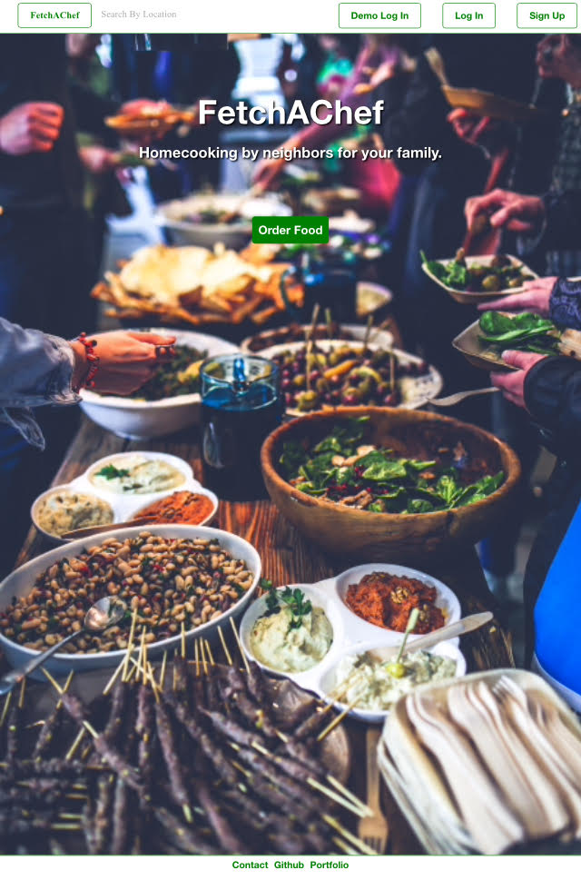
